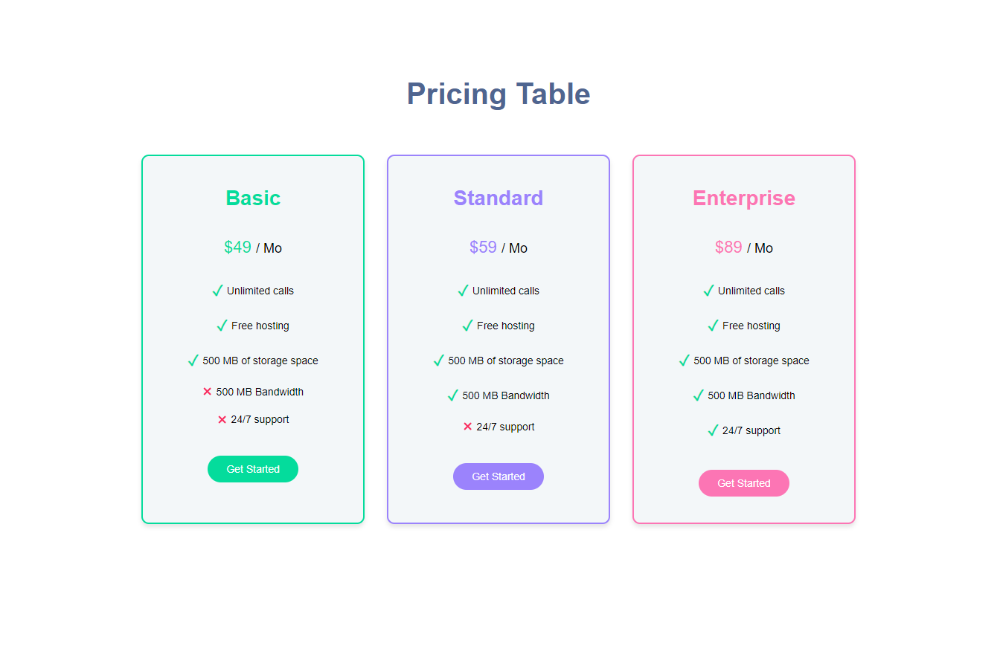
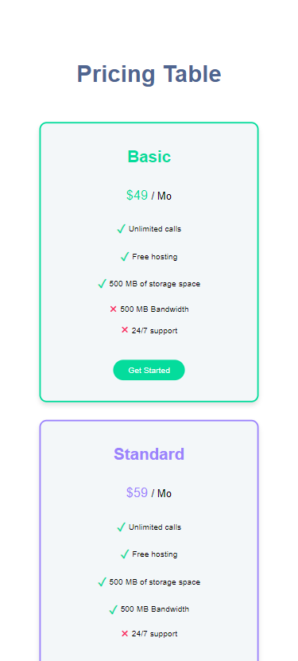

# Pricing Table
This project showcases a responsive pricing table built using React, Vite, TypeScript, and Sass. The table includes three pricing cards (Basic, Standard, and Enterprise) with different features and prices, as well as Get Started buttons.

## Features
* Responsive design
* Clean, modern look
* Utilizes variables, mixins, and nesting in Sass

## Screenshots

### Desktop View

### Mobile View

## Live Demo
Experience the Pricing Table in action by visiting the live demo:

[Pricing Table Live Demo](https://obrm-pricing-table.netlify.app)

## Usage
To run the app locally, follow these steps:

1. Clone the repository and navigate to the project folder.
2. Run `npm install` to install the required dependencies.
3. Run `npm run dev` to start the development server.
4. Open your browser and visit http://localhost:5173 to view the app.

#### Technologies Used

* [React](https://reactjs.org/)
* [TypeScript](https://www.typescriptlang.org/)
* [SCSS](https://sass-lang.com/)
* [Vite](https://vitejs.dev/)

#### License

[MIT](https://choosealicense.com/licenses/mit/)

## Contact Information
For any questions, concerns, or support, feel free to reach me out via email: [obrm770@gmail.com](mailto:obrm770@gmail.com).